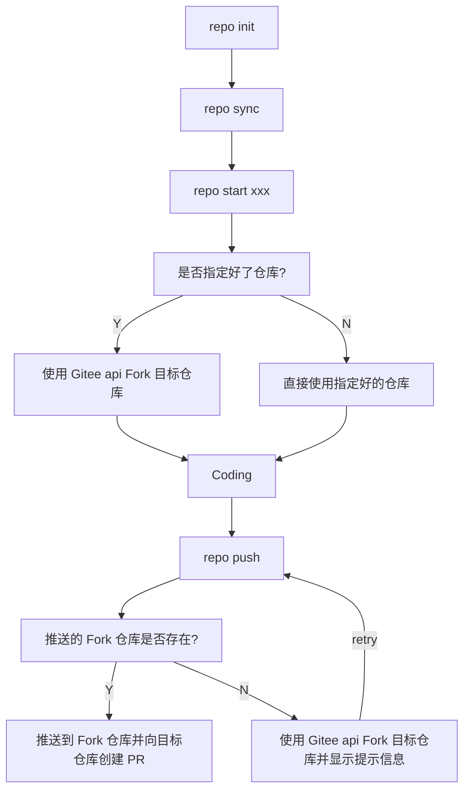

### 使用流程介绍
**注意:** 以下说明中包含 {*} 的内容均代表变量
1. manifest.xml 文件配置
2. repo 引导命令下载
3. repo init 初始化
4. repo sync 仓库同步
5. repo start {BRANCH} [project1, project2] 进行批量分支切换开始开发......
6. repo stage 或 repo forall -c git add . 存入文件 git 暂存区
7. repo config repo.token {ACCESS_TOKEN} 配置 gitee 个人 API token
8. repo config repo.pullrequest {True/Fales} 配置是否开启 push 后，向指定分支进行的 PR 提交的特性
9. repo push -p --br={BRANCH} --d={DEST_BRANCH} --new_branch 用本地的指定分支向远程推送并关联，推送成功后向指定的分支进批量提交
10. repo sync 或 repo forall -c git pull 进行代码批量同步

### Manifest 配置例子
在名为 **manifest** 的仓库中创建一个 default.xml 文件作为 repo 初始化的依据
以下为 repo init 初始化命令, 需要用 **-u** 参数来指定 manifest 的远程仓库地址
```shell
repo init -u git@gitee.com:{namespace}/manifest.git
```

**default.xml文件用例**
```xml
<?xml version="1.0" encoding="UTF-8"?>
<manifest>
  <remote  name="gitee"
           fetch="git@gitee.com:{namespace}"
           autodotgit="true" /> <!--fetch=".." 代表使用 repo init -u 指定的相对路径 也可用完整路径，example:https://gitee.com/MarineJ/manifest_example/blob/master/default.xml-->
  <default revision="master"
           remote="gitee" /><!--revision 为默认的拉取分支，后续提 pr 也以 revision 为默认目标分支-->

  <project path="repo_test1" name="repo_test1" />  <!--git@gitee.com:{namespace}/{name}.git name 与 clone 的 url 相关-->
  <project path="repo_test2" name="repo_test2" />
</manifest>
```
1、需要注意的是 default 的 **revision** 属性代表着之后提交 PR 的目标分支
2、不同的项目也可以有不同的 **revision** ，也就是说之后提交 PR 的目标分支也可不同， **revision** 的优先级由低到高
3、fetch 当前只支持 gitee 的 ssh

### 1. Repo 引导命令安装
```shell
# python3 版本向下兼容，注意这里应该下载是 repo-py3，而不是 repo
# PS: 这里下载的 repo 只是一个引导脚本，需要后续 repo init 后才有完整功能
curl https://gitee.com/oschina/repo/raw/fork_flow/repo-py3 > /usr/local/bin/repo
# 赋予脚本可执行权限
chmod a+x /usr/local/bin/repo
# 安装 requests 依赖，如果跳过这一步，后续执行命令时会自动提示安装
pip install -i https://pypi.tuna.tsinghua.edu.cn/simple requests

# 如果安装成功但是还是提示错误，建议使用 PyEnv 进行 Python 环境的管理
https://gitee.com/mirrors/pyenv
```

### 2. Repo 初始化与仓库初次同步
```shell
mkdir your_project && cd your_project
repo init -u git@gitee.com:{namespace}/manifest.git
repo sync
```

### 3. Repo + Gitee 本地开发流程
```shell
repo start {branch} --all # 切换开发分支，当对部分仓库进行指定时，会触发仓库的预先fork
repo forall -c git add ./ git add / repo stage  # 批量加入暂存区或者单独加入
repo forall -c git commit / git commit  # 批量进行提交或者单独提交
repo config --global repo.token {TOKEN} # 进行 gitee access_token 配置, access_token 获取连接 https://gitee.com/profile/personal_access_tokens
repo config repo.pullrequest {True/False} # 对是否触发PR进行配置
repo push --br={BRANCH} --d={DEST_BRANCH}  # 进行推送并生成PR和审查，执行后会展示出可进行推送的项目，去掉注释的分支会进行后续推送
repo gitee-pr --br={BRANCH} # 获取项目推送后的指定分支的PR列表
```

 **repo push**  参数介绍

1、其中值得注意的是 **--dest_branch** 和 **--br** 参数，如果不填写对应的分支的话会基于默认分支进行操作，**--br** 默认会以当前分支进行提交，**--dest_branch** 会以manifest.xml中的default **revision** 作为默认目标分支
2、当 repo push 对仓库进行推送时，会默认向与 token 相关的用户个人 namespace 下的仓库推送，在切换分支时没有预先 fork 成功，则在 repo push 失败时会再次以 token关 联的用户对上游仓库进行 fork，fork 成功后再次 push 即可
3、repo push 默认会以 ssh 方式向 token 关联的用户的 namespace 下进行仓库推送，若需要改为 https，则可根据 repo config repo.pushurl {用户域名空间地址如:https://gitee.com/xxxx}

 **repo**  结果详情


 **repo gitee-pr** 参数介绍

1、在 --br={BRANCH} 参数情况下直接返回指定分支下，在 gitee 平台上已经提交过的 PR

### Repo 与 gitee 结合使用开发的逻辑流程图

